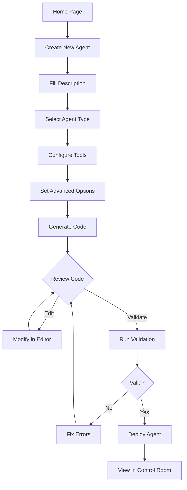

# Studio UI

## Overview

The Studio UI is a NextJS-based agent builder interface that allows users to create, configure, validate, and deploy AI agents through natural language descriptions and a visual form-based workflow.

| Attribute | Value |
|-----------|-------|
| **Location** | `frontend/studio-ui/` |
| **Port** | 3000 |
| **URL** | http://localhost:3000 |
| **Framework** | NextJS 15 + TypeScript |
| **Styling** | Tailwind CSS |

---

## Purpose

The Studio UI serves as the primary interface for:
- Describing AI agents using natural language
- Configuring agent parameters and capabilities
- Previewing and editing generated agent code
- Validating pattern compliance
- Deploying agents to containers

---

## Key Features

### 1. Agent Builder Form

A comprehensive form for defining agent specifications:

| Field | Type | Description |
|-------|------|-------------|
| **Description** | Textarea | Natural language description of the agent |
| **Agent Type** | Select | Solo, Multi-Agent, Swarm, Research, Assistant |
| **Complexity** | Select | Simple, Moderate, Complex |
| **Task Type** | Select | Classification, Generation, Analysis, etc. |

### 2. Tool Selection

Available tools for agent configuration:

| Tool | Description |
|------|-------------|
| Web Search | Search the web for information |
| Web Scraper | Extract content from web pages |
| Code Interpreter | Execute Python code |
| File Manager | Read/write file operations |
| Database | Query database connections |
| API Connector | Make HTTP requests |

### 3. Advanced Options

| Option | Description |
|--------|-------------|
| **LLM Provider** | OpenAI, Anthropic, Local |
| **Model Selection** | GPT-4, Claude, Llama, etc. |
| **Memory Type** | Conversation buffer, vector store |
| **Analytics** | Enable/disable usage analytics |

### 4. Code Preview Panel

- Monaco Editor integration for code viewing/editing
- File tabs for multiple output files:
  - `flow.py` - Main agent flow code
  - `agents.yaml` - Agent configuration
  - `requirements.txt` - Python dependencies
- Pattern compliance validation indicators
- Syntax highlighting and error detection

### 5. Agent Management

- List view of all saved agents
- Agent detail pages with full configuration
- Edit and update capabilities
- Duplicate/clone functionality
- Delete with confirmation

---

## Architecture

```
┌─────────────────────────────────────────────────────────────┐
│                      Studio UI                              │
│                   (NextJS - Port 3000)                      │
├─────────────────────────────────────────────────────────────┤
│  Pages                                                      │
│  ├── /              → Home/landing                          │
│  ├── /create        → Agent builder form                    │
│  ├── /agents        → Agent list                            │
│  └── /agents/[id]   → Agent detail/edit                     │
├─────────────────────────────────────────────────────────────┤
│  Components                                                 │
│  ├── ui/            → Base UI components                    │
│  ├── agent-builder/ → Form sections and inputs              │
│  ├── code-editor/   → Monaco editor wrapper                 │
│  └── export/        → Export and deploy actions             │
├─────────────────────────────────────────────────────────────┤
│  Hooks                                                      │
│  ├── useAgentGenerator.ts → Code generation state           │
│  └── useDeployment.ts     → Deployment management           │
└─────────────────────────────────────────────────────────────┘
                    │                       │
                    ▼                       ▼
      ┌──────────────────────┐   ┌─────────────────────────┐
      │  Agent Generator API │   │  Docker Orchestrator    │
      │      (Port 8001)     │   │      (Port 8002)        │
      └──────────────────────┘   └─────────────────────────┘
```

---

## Project Structure

```
frontend/studio-ui/
├── app/
│   ├── page.tsx                # Home/landing page
│   ├── layout.tsx              # Root layout
│   ├── create/
│   │   └── page.tsx            # Agent builder form
│   ├── agents/
│   │   ├── page.tsx            # Agent list
│   │   └── [id]/
│   │       └── page.tsx        # Agent detail/edit
│   └── api/
│       └── generate/
│           └── route.ts        # API proxy route
├── components/
│   ├── ui/                     # Base components (button, input, etc.)
│   ├── agent-builder/          # Form components
│   ├── code-editor/            # Monaco editor components
│   └── export/                 # Export/deploy components
├── hooks/
│   ├── useAgentGenerator.ts    # Generation logic
│   └── useDeployment.ts        # Deployment logic
├── lib/
│   └── api.ts                  # API client functions
├── types/
│   └── index.ts                # TypeScript definitions
├── Dockerfile
└── package.json
```

---

## API Integration

### Agent Generator API (Port 8001)

| Endpoint | Method | Description |
|----------|--------|-------------|
| `/api/generate-agent` | POST | Generate agent code from description |
| `/api/validate-code` | POST | Validate generated code |
| `/api/patterns` | GET | List available patterns |
| `/api/templates` | GET | List agent templates |

### Docker Orchestrator API (Port 8002)

| Endpoint | Method | Description |
|----------|--------|-------------|
| `/api/deploy` | POST | Deploy agent to container |
| `/api/build` | POST | Build container image |

---

## Requirements

### Functional Requirements

#### Agent Builder
- [ ] Natural language description input with character count
- [ ] Agent type selection (Solo, Multi-Agent, Swarm, Research, Assistant)
- [ ] Complexity level selection
- [ ] Task type categorization
- [ ] Tool selection with checkboxes/toggles
- [ ] Advanced options panel (collapsible)

#### Code Generation
- [ ] Real-time code generation on form changes
- [ ] Display generated `flow.py`, `agents.yaml`, `requirements.txt`
- [ ] Syntax highlighting in code preview
- [ ] Pattern compliance indicators
- [ ] Validation error display

#### Code Editor
- [ ] Monaco Editor integration
- [ ] Tab switching between files
- [ ] Edit capability with dirty state tracking
- [ ] Save/reset changes

#### Agent Management
- [ ] List all saved agents
- [ ] Search and filter agents
- [ ] View agent details
- [ ] Edit existing agents
- [ ] Delete agents with confirmation
- [ ] Duplicate/clone agents

#### Deployment
- [ ] Deploy to Docker container
- [ ] Deployment status feedback
- [ ] Link to Control Room after deployment

### Non-Functional Requirements

- [ ] Initial page load < 3 seconds
- [ ] Code generation response < 10 seconds
- [ ] Form validation feedback < 100ms
- [ ] Responsive design (desktop primary, tablet support)
- [ ] Accessibility (WCAG 2.1 AA)
- [ ] Dark mode support

### Technical Requirements

- [ ] NextJS 15 with App Router
- [ ] TypeScript strict mode
- [ ] Tailwind CSS for styling
- [ ] React Hook Form for form state
- [ ] Zod for schema validation
- [ ] Monaco Editor for code editing
- [ ] Error boundary components
- [ ] Loading states and skeletons

---

## User Flow



---

## Dependencies

### Backend Services

| Service | Port | Purpose |
|---------|------|---------|
| Agent Generator | 8001 | Code generation API |
| Docker Orchestrator | 8002 | Container deployment |

### NPM Packages

```json
{
  "dependencies": {
    "next": "^15.x",
    "react": "^19.x",
    "react-dom": "^19.x",
    "tailwindcss": "^4.x",
    "@monaco-editor/react": "^4.x",
    "react-hook-form": "^7.x",
    "zod": "^3.x",
    "@hookform/resolvers": "^3.x"
  }
}
```

---

## Current Status

| Status | Notes |
|--------|-------|
| **Phase** | Planning/Design |
| **Implementation** | Blocked |
| **Blocker** | Requires Phase 2 (Core Services) completion |

The Studio UI implementation will begin after the core backend services (Agent Generator and Docker Orchestrator) are fully operational and tested.

---

## Related Documentation

- [Control Room UI](./control-room-ui.md)
- [Agent Generator](../services/agent-generator/)
- [Docker Orchestrator](../services/docker-orchestrator/)
- [Architecture Overview](../README.md)
